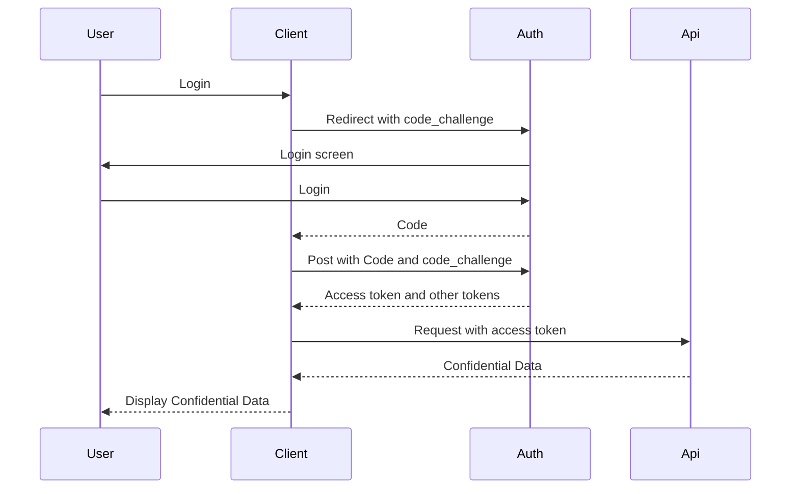

# SPA using Azure Active Directory B2C

Nov 2022

> Authorization code flow (with PKCE)

OAuth 2.0 Authorization code flow (with PKCE) allows the application to exchange an authorization code for ID tokens to represent the authenticated user and Access tokens needed to call protected APIs. In addition, it returns Refresh tokens that provide long-term access to resources on behalf of users without requiring interaction with those users.



## Single Page application redirect to authorize endpoint

Application redirect to authorize  

```
https://{tenant}.b2clogin.com/{tenant}.onmicrosoft.com/{policy}/oauth2/v2.0/authorize
?client_id={client-id}
&response_type=code
&response_mode=query
&redirect_uri={redirect-uri}
&scope=offline_access https://{tenant-name}/{app-id-uri}/{scope}
&code_challenge=ThisIsntRandomButItNeedsToBe43CharactersLong
```

Example Get request 
```
https://{tenant}.b2clogin.com/{tenant}.onmicrosoft.com/B2C_1A_SignIn/oauth2/v2.0/authorize?client_id=ac6d4172-4cf8-4d0c-a131-2c37053ead05&response_type=code&response_mode=query&redirect_uri=https://jwt.ms&scope=offline_access https://{tenant}.onmicrosoft.com/appealsapi/Appeal.Create&code_challenge=ThisIsntRandomButItNeedsToBe43CharactersLong
```

Once authenticated Authentication service redirects to redirect_uri with authorization code in query string

Example response 
```
https://jwt.ms/?code=eyJraWQiOiJFMGZvSTJCNzJlUmxJVkVGUjREWFl2Rkktb3pOQWFTendoQzg1bUVaWVdvIiwidmVyIjoiMS4wIiwiemlwIjoiRGVmbGF0ZSIsInNlciI6IjEuMCJ9.IQpGQIheAvYLF1PqAiKzqXAIWru7efXElZIu2_pw6uVnFtVCpUL5VhHfhdSdm_IPctvE9wieoRn6R3ZP-9GLm5oGLySdTIkcUXhNRmiltxXrE5o_V4ffy1D-EMqJ79RhMO-z1c3qSB7I8n36uEvdMf8PtnhdYCRekUh17Ee1cOmHY5_ls3zVNbILgKbLQ3kBoQ7FkjkZKMOVuUUmC_NWI5P28bCjlliYnCI1T8i-hNTZRHcMZAuqe7cu5yvH_NMZwOgAyDKdnAB3zhZGZXzcc4nDv-gcg9ZcVCgv7BM3y4OwDu6FPwW2CmhC956yKAMPBmTGiiUX0AVxAAD8IJzG4A.BTLBZ4mmLvmVC3-N.Gddq28kjPQjTC3jU9YjK7iwUeW3I_nX9lUSfIgsC3vzqb3rvWrLV99fD246OR0oSYQ0BhJRQmvdQsGL_OOmSe-8hahCc44pxCWrpexH-fnMlwpVAdXZ0hT_4kbiAfN9E2HfUda5PwJ8MlHZ5GQAtRf7rTV8B2aV9Hlji_EiysYhxbdybvf4mUr3T-uEJ9V1l3kYBVWxeLCVI-wD_OZ9OPNB7VphMnxTRiDhbg1mayWT2MpbaPWMI5fHYrQtfAe9_bg3DsCHtNwBWSIrqS4v5w54hlD4BZ-sn50LchXWv3-sIIO7PdAcFly2FU48VVu3BDkxWR9Aa7KguoWBOf6lw7ftC7aYtxGiMvZ2JVNBx4zvtZBbPg8AtPbwuiRWjUMHQhAHZJqG2w9MIUWl8e42uiPP7mRkRRltgoFMiYegviQqLvTLoPoz64ExK9UFY8CtAd5yDOwW5wGyCtT61-S6v8n4L-yurWddpTzRaNw4K1gkWdRPtK59U8uM6WvgcXAuS_E3OKhukeDdSuIfraVUTrFYbA5xdbB44I97Pek7Q5n1Fa-IdvCpEJ-DofMwv6rP3tdMzqkKGjWwmQSeNMXLsEELds-YS16UfCPSKm__7wUt3wcZbBqkGR7TrvFsiCZjwEus3XUsfthBx5Pf2E6Ddr00zE4xDYzoLSbXkxjgRUrMCgJtL7ELYq4rqkG0JsCJevaVMoSUdm2rbq0yFeXEu0VjdfFTKAVooqvoijJWL1M4v6sD0Kme7E81XGX52OGgVKGJz6xIxfmREWHsBHX5Wa8LrbUNKZzBqn0PQaNgzb8-msLb-TsA6jsBQlpg7dRV-VgxJGvFtd1FYXuhzaA.m9QXmAP19vV07ri3RG1k_Q
```

Exchange the authorization code for an access token using from (application/x-www-form-urlencoded) post 

```
https://{tenant}.b2clogin.com/{tenant}.onmicrosoft.com/{policy}/oauth2/v2.0/token

grant_type=authorization_code
&client_id={client-id}
&scope=offline_access https://{tenant-name}/{app-id-uri}/{scope}
&code={code}
&redirect_uri={redirect-uri}                               
&code_verifier=ThisIsntRandomButItNeedsToBe43CharactersLong
```

Example POST httpie request 
```
http --form POST https://{tenant}.b2clogin.com/{tenant}.onmicrosoft.com/B2C_1A_SignIn/oauth2/v2.0/token grant_type="authorization_code" client_id="ac6d4172-4cf8-4d0c-a131-2c37053ead05" scope="offline_access https://{tenant}.onmicrosoft.com/appealsapi/Appeal.Create" redirect_uri="https://jwt.ms" code_verifier="ThisIsntRandomButItNeedsToBe43CharactersLong" code="eyJraWQiOiJFMGZvSTJCNzJlUmxJVkVGUjREWFl2Rkktb3pOQWFTendoQzg1bUVaWVdvIiwidmVyIjoiMS4wIiwiemlwIjoiRGVmbGF0ZSIsInNlciI6IjEuMCJ9.dzrGiLYv70_8ZLOunmkcf5sxZYW3bq8IwJ2s-8O2i5u2-5l_l7b8F4o5USLwtrXgE6VR1drJhWDl5TQRZC_HygZwlilyrCK4vpK_hPyPKMWHbhgUPYr4WT4nBYVMreZYVf8I86SV2ULjOAHM3dHd-RqZAdBMSS7w0Pp2LsiV0Ta45eYPXDm0wZQYPLMr1ZCyqqVHstskz8yfD22vPz6SCBmCnqxByh0XeYVklR3BdLxj23RIdIA28hg9ysP7B2FyUCW7bigjq-ZOjGD0w7v9S5mxYd-xy2DjgaiNAc2DLeNR8p5snEIdc-m5mK6MvToKwKEJ380y68qqfc8cECB6TQ.dTX1WWZaZWPrGoua.j_yyFPmvnwylj3DuV5ms-XPZckgFM2hOOF9hVQSMgFbd4MgRCVa8mAbGqt3fRehe5XEXAeqlazN1A2pCPYzrIlBnEehGgpToSoBYNif_L3B1B20Y4Ngbx16yoNcrWvWUBNDZBNwxho8qvaaiPJ-lApJ7Ny1r8qpjHM0l5GKvSNFJjePxgZAufHeodcyyJweHnS4bUOeq_WhrbqqBfkXrJ5x-dB-pzCTd4r35xcqiZBZCfHpCzS08Vcig2rTp9Qz7VYhBJyjlYmewNC-Gwg6FXGLtvmDbdfbX463T0fEwsOCoQfLeBKDRDH_DA6njuGvIcWyDLwWYnpN9NkdYINYOU7AYk2ZKW_Ls7cQhEYKIMzB7z8Ndm0lYYaG3nq7g-i0-Ppb4bI8umkM7o1BjfSW5B9pGa79z7lHTCAG-cjqiKa_OOkDcrNBzceYS25t0Ee4pBWK7PJ1uf4wS3Ydy57TP8j_eQSkcx7fQzk8APfca0xWIWw1zSDIka51EVOGWrIoMvCXehZAPvdbavtND-naZlq1HolSMhDEKiL7yaMTMkg2silzxBnaaLBII6aKHuHeFtoHWXbmI6ZHfPSZl2CCgMivgKBB1Mgw-v94fM-ZUONOypic1OZ8Hs7E7fSv7YvQrwcWG8JPmhxBmKPm30AebnxV9XpmEZwm8kuMsQ8auoN9uD3LtK7_7I2WF8kYgfo5H3c0cy35v4iFtCZ5HpWYBMkZOpLWnsjRCPRBthYhvURTfboXEETGJLjdoIe3ga2W_X0GsXHpSseepNOt3iway1zt-XMZMIcke2xqmeylJ6sRoU-dW4_VdViNya6muu5BsiNnlEItozwKSuwsR.XVRAW2i9FQK3BmZyizRUAA"
```

Add jq to extract property 
```
http --form POST https://{tenant}.b2clogin.com/{tenant}.onmicrosoft.com/B2C_1A_SignIn/oauth2/v2.0/token grant_type="authorization_code" client_id="ac6d4172-4cf8-4d0c-a131-2c37053ead05" scope="offline_access https://{tenant}.onmicrosoft.com/appealsapi/Appeal.Create" redirect_uri="https://jwt.ms" code_verifier="ThisIsntRandomButItNeedsToBe43CharactersLong" code="eyJraWQiOiJFMGZvSTJCNzJlUmxJVkVGUjREWFl2Rkktb3pOQWFTendoQzg1bUVaWVdvIiwidmVyIjoiMS4wIiwiemlwIjoiRGVmbGF0ZSIsInNlciI6IjEuMCJ9.dzrGiLYv70_8ZLOunmkcf5sxZYW3bq8IwJ2s-8O2i5u2-5l_l7b8F4o5USLwtrXgE6VR1drJhWDl5TQRZC_HygZwlilyrCK4vpK_hPyPKMWHbhgUPYr4WT4nBYVMreZYVf8I86SV2ULjOAHM3dHd-RqZAdBMSS7w0Pp2LsiV0Ta45eYPXDm0wZQYPLMr1ZCyqqVHstskz8yfD22vPz6SCBmCnqxByh0XeYVklR3BdLxj23RIdIA28hg9ysP7B2FyUCW7bigjq-ZOjGD0w7v9S5mxYd-xy2DjgaiNAc2DLeNR8p5snEIdc-m5mK6MvToKwKEJ380y68qqfc8cECB6TQ.dTX1WWZaZWPrGoua.j_yyFPmvnwylj3DuV5ms-XPZckgFM2hOOF9hVQSMgFbd4MgRCVa8mAbGqt3fRehe5XEXAeqlazN1A2pCPYzrIlBnEehGgpToSoBYNif_L3B1B20Y4Ngbx16yoNcrWvWUBNDZBNwxho8qvaaiPJ-lApJ7Ny1r8qpjHM0l5GKvSNFJjePxgZAufHeodcyyJweHnS4bUOeq_WhrbqqBfkXrJ5x-dB-pzCTd4r35xcqiZBZCfHpCzS08Vcig2rTp9Qz7VYhBJyjlYmewNC-Gwg6FXGLtvmDbdfbX463T0fEwsOCoQfLeBKDRDH_DA6njuGvIcWyDLwWYnpN9NkdYINYOU7AYk2ZKW_Ls7cQhEYKIMzB7z8Ndm0lYYaG3nq7g-i0-Ppb4bI8umkM7o1BjfSW5B9pGa79z7lHTCAG-cjqiKa_OOkDcrNBzceYS25t0Ee4pBWK7PJ1uf4wS3Ydy57TP8j_eQSkcx7fQzk8APfca0xWIWw1zSDIka51EVOGWrIoMvCXehZAPvdbavtND-naZlq1HolSMhDEKiL7yaMTMkg2silzxBnaaLBII6aKHuHeFtoHWXbmI6ZHfPSZl2CCgMivgKBB1Mgw-v94fM-ZUONOypic1OZ8Hs7E7fSv7YvQrwcWG8JPmhxBmKPm30AebnxV9XpmEZwm8kuMsQ8auoN9uD3LtK7_7I2WF8kYgfo5H3c0cy35v4iFtCZ5HpWYBMkZOpLWnsjRCPRBthYhvURTfboXEETGJLjdoIe3ga2W_X0GsXHpSseepNOt3iway1zt-XMZMIcke2xqmeylJ6sRoU-dW4_VdViNya6muu5BsiNnlEItozwKSuwsR.XVRAW2i9FQK3BmZyizRUAA" | jq -r ".access_token"
```

## Id token and code 

```
https://{tenant}.b2clogin.com/{tenant}.onmicrosoft.com/{policy}/oauth2/v2.0/authorize
?client_id={client-id}
&response_type=id-token+code
&response_mode=query
&redirect_uri={redirect-uri}
&scope=openid offline_access https://{tenant-name}/{app-id-uri}/{scope}
&code_challenge=ThisIsntRandomButItNeedsToBe43CharactersLong
```