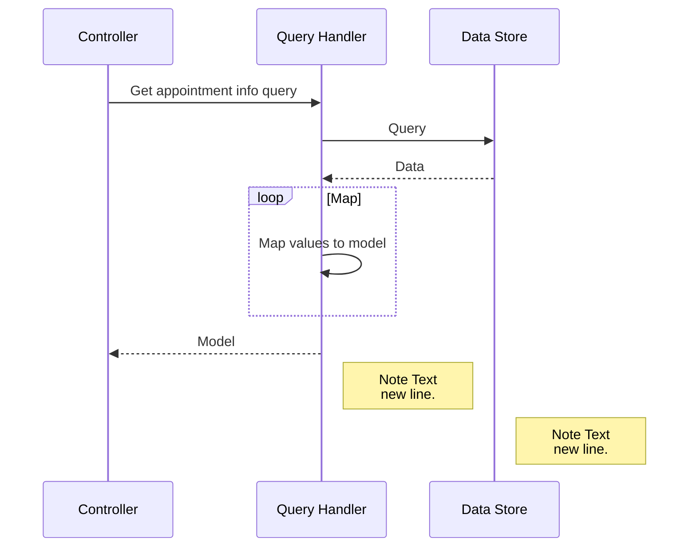

# Mermaid

> Mermaid

Mermaid Sequence Diagram

```mermaid
sequenceDiagram
    participant A as Controller
    participant B as Query Handler
    participant C as Data Store

    A ->> B: Get appointment info query

    B ->> C: Query
    C -->> B: Data

    loop Map
        B->> B: Map values to model
    end
    
    B -->> A: Model

    Note left of C: Note Text <br/>new line.
    Note right of C: Note Text <br/>new line.
```

https://mermaid-js.github.io/