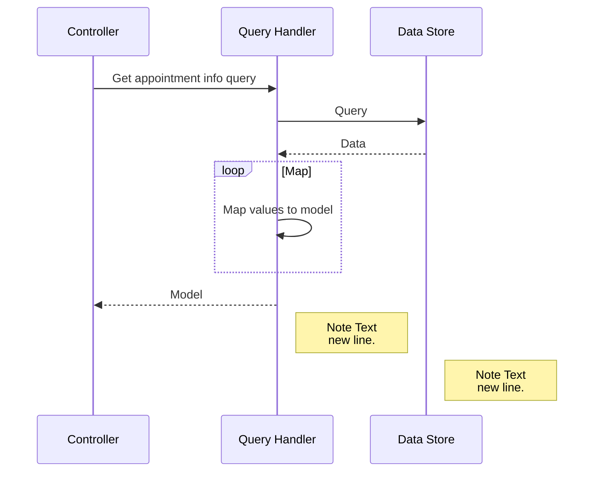
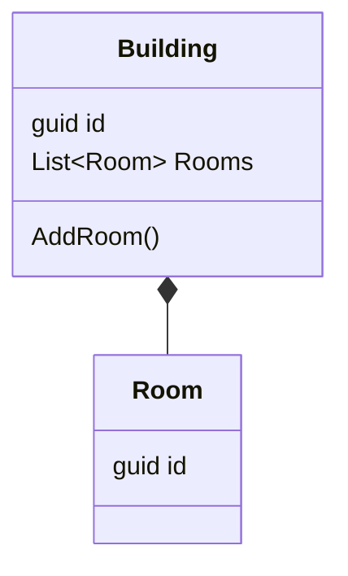

# Mermaid

> Mermaid syntax and tool allows creation of key Uml diagrams using text  

Mermaid is diagramming tool/syntax for text definitions.

It is a JavaScript based diagramming and charting tool that renders Markdown-inspired text definitions to create and modify diagrams dynamically.

## Sequence Diagram

## Class Diagram

https://mermaid-js.github.io/
