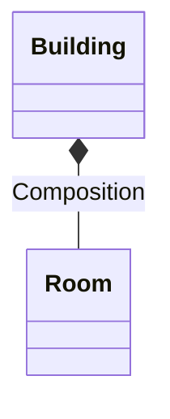
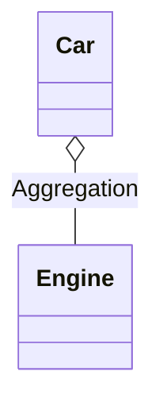
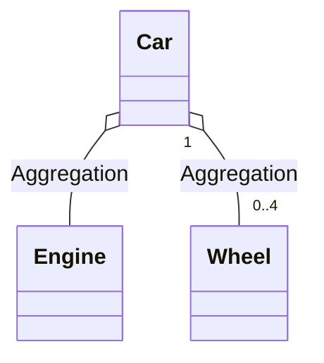
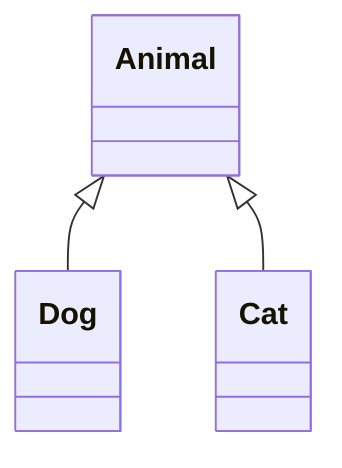
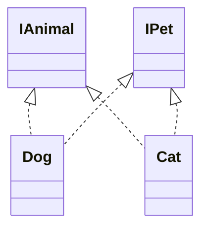
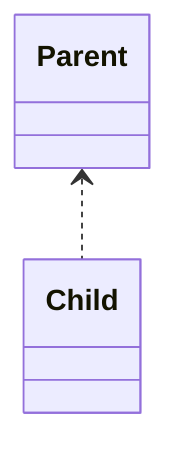

# Uml Relationships

Oct 2022 

> Key Uml relationships

## Uml Composition relationship

Relationship between whole class and part class.

When whole class is deleted then part class is also deletd as a result for example Building class (whole class) and Room classes (part class).

A Building can have many rooms a Room cannot exist without a Building.

Remove Building removes all related rooms.

## Uml Aggregation relationship

Both classes can exist independent of each other.

When one class is deleted then other class remains for example Car class and Engine both exist independent of each other.

A Car can have a Engine, the Engine can be removed from the Car.

## Uml Aggregation relationship

Both classes can exist independent of each other.

When one class is deleted then other class remains for example Car class and Engine both exist independent of each other.

A Car can have a Engine, the Engine can be removed from the Car.

## Uml Inheritance relationship

A Dog is an Animal, Dog is a specialised Animal 

Animal generalisation of a Dog and Cat 

## Uml Realization relationship

Relationship implementation to interface, interface describes contract behaviour, implementation implements behaviour.

Cat Dog are implementation/concrete classes 

IAnimal IPet describes contract behaviour. 

## Uml Dependency

https://www.uml-diagrams.org/association.html